<div align="center">

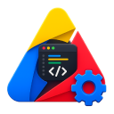

# Google Apps Script Tools

**Turn the Google Apps Script editor into a modern IDE.**
AI suggestions, in-line errors, multi-file search, GitHub sync, folders, snippets and 50+ themes — without leaving your browser.

[**Install from the Chrome Web Store →**](https://chromewebstore.google.com/detail/google-apps-script-tools/iigobcdpmngdgiacebgenbccmdacnjhp)

<br>

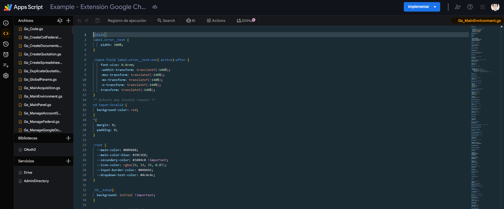

</div>

---

## Why use it

Apps Script is a great runtime, but its editor is missing most of the things you have in VS Code, Cursor or any other modern IDE. This extension fills that gap on top of the tab you already have open.

- **AI suggestions** as you type, with context from your project.
- **AI chat** with eight providers — bring your own key.
- **Live errors** highlighted right at the line, no save required.
- **GitHub sync** with visual diff and per-file selection.
- **Folders** in the file tree, with collapsible groups and color icons.
- **Multi-file search** across the whole project.
- **50+ themes** plus a built-in theme editor.
- **Snippets** with a built-in catalog and a custom editor.

Everything is free and works on top of the editor you already use.

---

## What you get

### Modern dark editor

A clean, modern look on top of the standard Apps Script editor. Pick any theme — Dracula, Monokai, Solarized, Night Owl, One Dark, Cobalt and 45+ more — or build your own. Folders, color file icons and indentation guides come bundled.

<div align="center">
  
</div>

### AI suggestions and chat

Inline ghost-text completions while you type. Press `Tab` to accept. A chat panel sits next to your code so you can ask questions, refactor or generate snippets without leaving the tab.

- Eight providers supported: OpenAI, Anthropic (Claude), Google Gemini, DeepSeek, Kimi (Moonshot), Nvidia Build, ChatLLM and OpenRouter.
- `@selection`, `@file` and `@project` to send context with one click.
- Quick actions in every code block: copy, insert at cursor or replace selection.
- API keys live in your browser. Requests go from your machine straight to the provider.

<div align="center">
  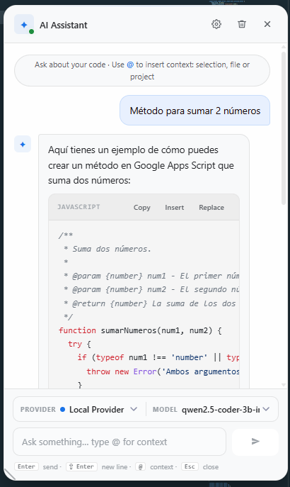
</div>

### Live errors

The active file lights up the moment you stop typing. A pulsing dot in the toolbar tells you when there are issues. Click any error to see the message at the offending line — no need to save and run.

Detects unclosed parentheses, unterminated strings, `==` / `!=` (suggests `===` / `!==`), reassigning a constant, duplicate parameters, assignments inside `if` / `while`, unreachable code after `return` / `throw`, missing semicolons, comparing with `NaN` and more.

### Active file panel

A toolbar button that always shows the active file's name — even when the Apps Script tree doesn't reflect it. Click it for a popover with the language detected, line count, file size and a live count of errors, warnings and hints.

<div align="center">
  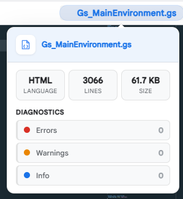
</div>

### Multi-file search

Press `Alt+Shift+F` and search across every file in the project at once. Results are grouped by file, you can move with `↑ / ↓ / Enter`, and one click jumps to the match.

<div align="center">
  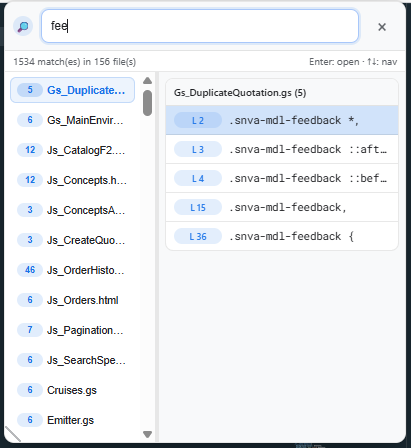
</div>

### GitHub sync

Connect your GitHub account once and the editor gets a sync panel. Sign in with Google so the extension can read and write your project files via the Apps Script API, then sign in with GitHub. Pick a repo and branch and you are ready.

- Visual diff per file, line by line.
- Pick exactly which files to push, file by file.
- Pull creates new files automatically — no manual steps in the GAS sidebar.
- Live progress: see each file as it uploads or merges, with retries that resume from where they failed.
- Tokens stay in your browser. Your code never goes through a server we control.

<div align="center">
  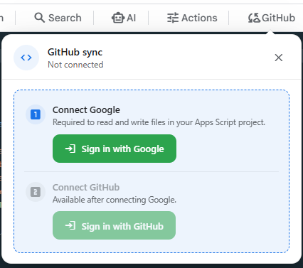
  <br><br>
  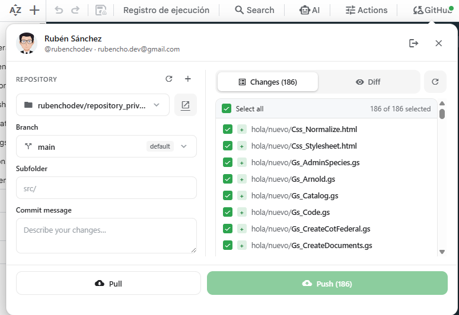
</div>

### Project actions

A toolbar button that gathers small but useful project tools in one place: download the entire project, refresh the file tree, jump to settings and more. Designed to save clicks.

<div align="center">
  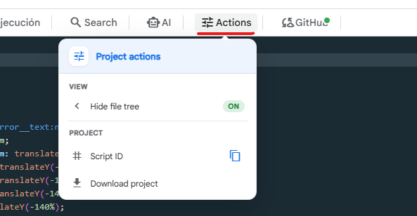
</div>

---

## What you can configure

Click the extension icon in Chrome to open the popup. From there you control everything.

### Editor and appearance

Pick the active theme from a catalog of 50+ designs (Dracula, Monokai, Solarized, Night Owl, One Dark, Cobalt, Twilight, Xcode, Material Dark and many more). Tweak font, font size and line height. Choose between popular monospace fonts: JetBrains Mono, Fira Code, Roboto Mono and more.

Toggle the editor behavior to your liking: minimap, line numbers, word wrap, current line highlight, vertical rulers at 80 / 120 columns, render whitespace, bracket pair colorization, auto-closing brackets, indentation guides, code folding, smooth scrolling, scroll past the last line, tab size, cursor style and blinking, and more.

<div align="center">
  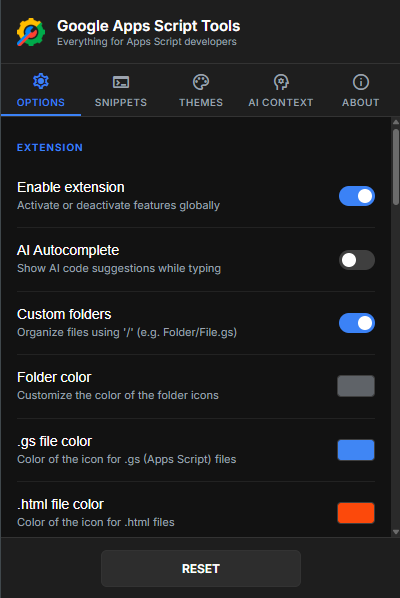
</div>

### Themes

Apply a theme with one click. Duplicate any theme to start from a template, edit every color token in the visual editor, or build a new theme from scratch. Your custom themes live next to the built-in ones.

<div align="center">
  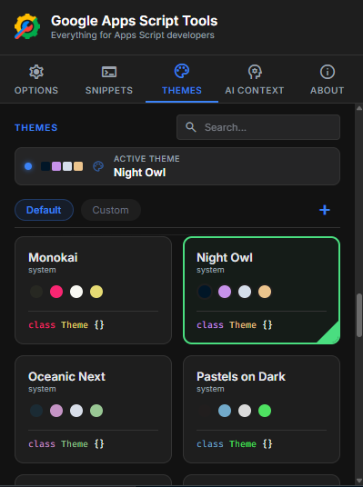
</div>

### Snippets

A built-in catalog of useful snippets for JavaScript and HTML / GAS — `clog`, `gss`, `htmlgas`, and more. Create, duplicate, edit or delete your own snippets from the popup. They are triggered by their prefix in the editor's autocomplete.

<div align="center">
  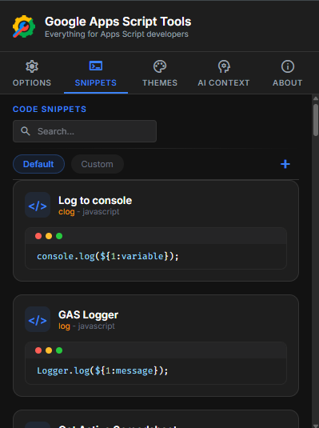
</div>

### AI

Choose a provider, paste your key, optionally tweak the model and the system prompt. The extension keeps the credentials per-provider so you can switch with a click. Each provider knows its own list of models so you don't have to guess.

<div align="center">
  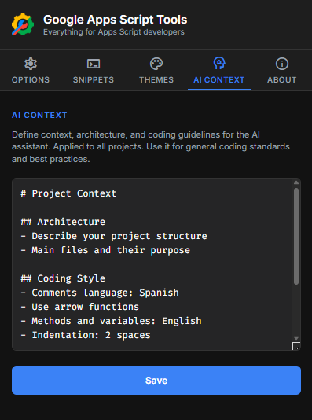
</div>

### About

A summary screen with the version, links to the privacy policy, the terms of use and the contact email. Use the master switch on this screen to pause every feature in one click without uninstalling.

<div align="center">
  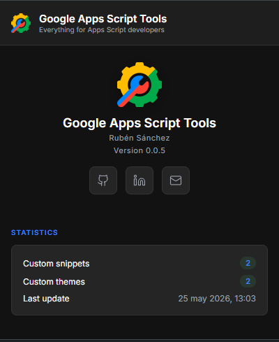
</div>

---

## Keyboard shortcuts

| Shortcut         | Action                              |
| ---------------- | ----------------------------------- |
| `Tab`            | Accept the current AI suggestion.   |
| `Alt+Shift+F`    | Open multi-file search.             |
| `Alt+Shift+C`    | Open the AI chat panel.             |

---

## Installation

Install in one click from the [Chrome Web Store](https://chromewebstore.google.com/detail/google-apps-script-tools/iigobcdpmngdgiacebgenbccmdacnjhp).

After install, open any Apps Script project. The toolbar will gain new buttons (AI, search, current file, actions, GitHub).

### Configure your AI

1. Open any Apps Script project.
2. Click the **AI** button in the toolbar (or press `Alt+Shift+C`).
3. Click the **Settings** (⚙️) icon inside the panel.
4. Pick a provider, paste your API key, optionally tweak the model and system prompt.

API keys are stored locally in Chrome. They are only sent to the provider you configured.

### Connect GitHub (optional)

1. Open any Apps Script project.
2. Click the **GitHub** button in the toolbar.
3. Sign in with Google (used to read and write your project content via the Apps Script API).
4. Sign in with GitHub (Device Flow — your token never leaves the browser).
5. Pick a repo and a branch. The panel shows the diff per file, lets you push selected files with a commit message, or pull updates from the repo.

---

## Privacy

The extension does not have a server. There is no account to create. Your code, your AI keys and your GitHub token live on your machine.

- No analytics, no tracking, no telemetry.
- AI requests go from your browser straight to the provider you chose.
- GitHub sync goes from your browser straight to GitHub.
- Project sync goes from your browser straight to Google's Apps Script API.
- Settings are stored in Chrome — they sync with your Google account if you have Chrome sync on.
- Open source under the MIT license.

For details, see the [privacy policy](pages/privacy-policy.html) and the [terms of use](pages/terms.html).

---

## FAQ

<details>
<summary><b>Is it really free?</b></summary>

Yes. The extension is free and open source under MIT. The only thing that costs money is the AI itself: you bring your own provider key (OpenAI, Claude, Gemini, etc.) and pay them directly for the usage. We never charge a cent.
</details>

<details>
<summary><b>Do I need to know how to code?</b></summary>

You should be familiar with Apps Script. The extension makes things faster and more pleasant for people already writing scripts. The AI chat helps a lot when you're stuck.
</details>

<details>
<summary><b>Does it slow down the editor?</b></summary>

No. The extension only activates inside the Apps Script editor and runs only the features you turn on. There is a master switch in the popup About screen to pause everything if you ever need to.
</details>

<details>
<summary><b>Will my code be sent to a server you control?</b></summary>

Never. AI requests go from your browser straight to the provider you chose. GitHub sync goes from your browser straight to GitHub. Apps Script sync goes from your browser straight to Google's API. We do not have a server in the middle.
</details>

<details>
<summary><b>Can I use it on a corporate Google account?</b></summary>

Yes, as long as your organization allows installing extensions from the Chrome Web Store. Some admins block extensions by policy — in that case ask IT to allow this one.
</details>

<details>
<summary><b>Does it work outside Chrome?</b></summary>

Today only on Chromium-based browsers (Chrome, Edge, Brave). The Apps Script editor itself runs there, so that is what we focus on.
</details>

<details>
<summary><b>What happens if a push or pull is interrupted?</b></summary>

The panel keeps track of the files that already finished. When you retry, those files are reused without re-uploading or re-downloading, so you don't waste time or hit GitHub's rate limits twice.
</details>

---

## Credits

- **File tree handling:** the idea and approach for the editor's file tree are based on [JeanRemiDelteil / appsScriptColor](https://github.com/JeanRemiDelteil/appsScriptColor). We used that project as a guide to understand how to work with the Apps Script editor's file structure.
- **Live linter (Error Lens):** the idea of showing diagnostics at the end of the line is inspired by [usernamehw / vscode-error-lens](https://github.com/usernamehw/vscode-error-lens). We based the integration on top of Monaco inside the Apps Script editor on that project.
- **GitHub sync via Apps Script API:** the approach for reading and writing the project content from outside the editor is inspired by [leonhartX / gas-github](https://github.com/leonhartX/gas-github/blob/master/src/gas/script-api.js).

---

## Contact

Questions, feedback or bug reports: **rubencho.dev@gmail.com**.

The repo also has a public issue tracker on [GitHub](https://github.com/rubendariosanchez).

---

## License

MIT — built by [Rubén Darío Sánchez](https://github.com/rubendariosanchez).

---

<details>
<summary><b>Local development</b></summary>

If you want to load the extension unpacked from this repo (instead of installing from the Chrome Web Store), there is one extra step for the GitHub sync panel.

The GitHub sync uses the Apps Script API to read and write your project's files. That requires a Google sign-in via `chrome.identity.getAuthToken`, which only works when the extension was packaged with an OAuth Client tied to its stable extension ID.

1. In Google Cloud Console, create an OAuth 2.0 Client of type **Chrome App** and enable the **Apps Script API** on the same project.
2. Use a stable extension ID. The simplest path is generating a key locally with OpenSSL:
   ```bash
   openssl genrsa 2048 | openssl rsa -pubout -outform DER | openssl base64 -A
   ```
   Add the resulting string as `"key"` in `manifest.json`. Reload the extension, copy the ID Chrome assigns, and use that ID when registering the OAuth Client in Cloud Console.
3. Replace `manifest.oauth2.client_id` with the Client ID you just got. The scopes (`script.projects`, `userinfo.email`, `userinfo.profile`) are already set.
4. Reload the extension and click **Sign in with Google** in the GitHub panel. The first time you'll see the Google consent screen.

Tokens are managed by Chrome's identity service. They are not persisted by this extension and never travel to the MAIN world.
</details>
